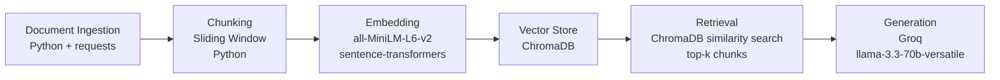

# Project 1 Planning: The Unofficial Guide

> Write this document before you write any pipeline code.
> Your spec and architecture diagram are what you'll use to direct AI tools (Claude, Copilot, etc.) to generate your implementation — the more specific they are, the more useful the generated code will be.
> Update the Retrieval Approach and Chunking Strategy sections if you change your approach during implementation.
> Update this file before starting any stretch features.

---

## Domain

Columbia University student life--specifically CS academic requirements, housing lottery strategy, dining, and disability accomodations. This knowledge is valuable because official sources are scattered across dozens of university websites, while the most useful advice lives in student blogs,Bwog articles, and Spectator guides that are hard to find trhough official channels.

---

## Documents

| # | Source | Description | URL or location |
|---|--------|-------------|-----------------|
| 1 | Columbia CS FAQ | CS major questions, waivers, double counting | https://www.cs.columbia.edu/undergrad-faq/ |
| 2 | CS Program Overview | Tracks, requirements, research opportunities | https://www.cs.columbia.edu/education/undergraduate/ |
| 3 | Housing Lottery Points | How lottery numbers and seniority points work | https://www.housing.columbia.edu/content/point-values-lottery-numbers-selection-appointments |
| 4 | Room Selection Guide | Full room selection process and eligibility | https://www.housing.columbia.edu/roomselection |
| 5 | Bwog Housing Strategy | Real student tips for rising sophomores | https://bwog.com/2026/02/columbia-housing-strategy-for-rising-sophomores/ |
| 6 | ODS Registration | How to register for disability accommodations | https://www.health.columbia.edu/services/register-disability-services |
| 7 | Spectator ODS Guide | Student perspective on navigating accommodations | https://www.columbiaspectator.com/spectrum/2022/12/04/a-guide-to-navigating-accommodations-with-disability-services/ |
| 8 | Morningside Heights Eating | Best restaurants near campus | https://www.columbiaspectator.com/arts-and-culture/2022/08/26/a-beginners-guide-to-morningside-heights-eating/ |
| 9 | Dining Halls Guide | Which dining halls are worth visiting | https://tcadmission.com/2024/09/24/your-guide-to-the-best-dining-halls-at-columbia/ |
| 10 | SEAS Advising Guide | Credit requirements and academic policies | https://www.cc-seas.columbia.edu/csa/advising_seas |

---

## Chunking Strategy

My documents are a mix of long guides and medium-length articles, not short reviews. I will use a chunk size of 500 characters with an overlap of 100 characters. This size is large enough to preserve a complete thought or policy explanation, while the overlap ensures taht facts that span chunk boundaries are still retrievable. Too small(under 200 characters) would strip context from policy statements like housing eligibility rules. Too large (over 1000 characters) would mix unrelated topics in one chunk, confusing retrieval.

**Chunk size:**

**Overlap:**

**Reasoning:**

---

## Retrieval Approach

I am using all-MiniLM-L6-v2 via sentence-transformers for embeddings, running locally with no API key required. I will retrieve top-k=5 chunks per query. Five chunks gives the LLM enough context to synthesize an answer without overwhelming it with irrelevant text. Semantic search works because the embedding model maps meaning into vector space — "housing assignment process" and "room selection lottery" land near each other even without shared words. If I had no cost constraints, I would evaluate text-embedding-3-large from OpenAI for better accuracy on domain-specific academic text, or a multilingual model if expanding beyond English sources.

**Embedding model:**

**Top-k:**

**Production tradeoff reflection:**

---

## Evaluation Plan

<!-- List your 5 test questions with their expected correct answers.
     Questions should be specific enough that you can judge whether the system's response
     is right or wrong. "What are good dining halls?" is too vague.
     "What do students say about wait times at [dining hall name] during lunch?" is testable. -->

| # | Question | Expected answer |
|---|----------|-----------------|
| 1 | | |
| 2 | | |
| 3 | | |
| 4 | | |
| 5 | | |

---
## Evaluation Plan

| # | Test Question | Expected Answer |
|---|--------------|-----------------|
| 1 | How does the Columbia housing lottery actually work? | Lottery numbers are assigned by seniority points — rising seniors get lowest numbers and earliest appointments |
| 2 | What is the best dining hall at Columbia? | Ferris Booth Commons is generally considered to have the best food quality |
| 3 | How do I register for disability accommodations at Columbia? | Submit registration form and documentation to ODS, takes approximately 3 weeks to review, then meet with a coordinator |
| 4 | What CS courses should I take first as a Columbia CS major? | ENGI E1006 first year, then COMS W1004, W3134, W3157, W3203 in first two years |
| 5 | What do students recommend for cheap food near Columbia? | Fumo for the 12 dollar pasta special, Absolute Bagels, and the halal cart near Shapiro Hall for late night |

---

## Anticipated Challenges

1. **Chunking splits policy information across boundaries.** Housing eligibility rules and CS course requirements often span multiple sentences. If a chunk ends mid-rule, neither chunk alone may answer the question correctly. Mitigation: use 100-character overlap to reduce this risk.

2. **Official sources and student sources may contradict each other.** The housing office says the lottery is random within point bands; the Bwog article gives tactical advice that implies it is not fully random. The LLM may produce a confusing answer that blends both. Mitigation: include source attribution in every retrieved chunk so the user can evaluate the source.

3. **Web pages may have changed since I collected them.** Dining hall menus, CS requirements, and ODS processes update regularly. My corpus is a snapshot in time.

---

## Architecture

---

## AI Tool Plan

**Chunking - chunk_text() function** I will give Claude my Chunking Strategy section and ask it to implement a sliding window chunker in Python that takes a string, chunk size of 500 characters, and overlap of 100 characters and returns a list of chunks.

**Verification approach for all stages:** For each AI-generated function, I will run it against a small test case before integrating it into the full pipeline — for example, testing chunk_text() on a short paragraph and manually checking that chunk boundaries and overlap match my spec, before running it on the full document corpus. 

**Ingestion — fetch and save documents:** I will give Claude my Documents table and ask it to write a Python script that fetches each URL, strips HTML tags, and saves clean text to a docs/ folder.

**Retrieval — embed_and_store() and query():** I will give Claude my Retrieval Approach section and ask it to implement ChromaDB storage and similarity search using sentence-transformers.

**Generation — prompt template:** I will give Claude my domain description and ask it to write a system prompt that instructs the LLM to answer questions using only the retrieved context and cite sources.

**Interface — Gradio app:** I will give Claude my domain description and the requirement that the interface accept a user question and display the generated answer along with cited sources. I expect it to produce a simple Gradio app.py with a text input, submit button, and output area. I will verify by running the app locally and confirming the UI loads and accepts input correctly.

**Milestone 4 — Embedding and retrieval:**

**Milestone 5 — Generation and interface:**
